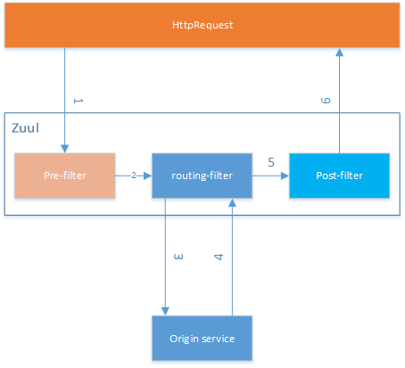

 #### @EnableZuulProxy 和 @EnableZuulServer

Spring Cloud Netflix installs a number of filters based on which annotation was used to enable Zuul. @EnableZuulProxy is a superset of  @EnableZuulServer. In other words, @EnableZuulProxy contains all filters installed by @EnableZuulServer. The additional filters in the "proxy" enable routing functionality. If you want a "blank" Zuul, you should use @EnableZuulServer.

#### eureka /info /health需要 spring boot 的 spring-boot-starter-actuator 的支持
#### Securing The Eureka Server 
spring-boot-starter-security 需要登陆 密码会在后台随机生成

# spring为服务组件
## zuul
### zuul 请求流转图



### 配置前缀
```
zuul:
  routes:
    hiapi:
      path: /hiapi/**
      serviceId: eureka-client
    ribbonapi:
      path: /ribbonapi/**
      serviceId: eureka-ribbon-client
    feiginapi:
      path: /feignapi/**
      serviceId: eureka-feign-client
	# 配置前缀
	prefix: /v1 
```
### zuul 熔断器
需要实现 FallbackProvider 接口

### zuul 过滤器
需要继承ZuulFilter,可以系统登陆验证

## 熔断器Hystrix
### 在RestTemplate和Ribbon上使用熔断器

 1. 添加依赖
 2. 启动Hystrix @EnableHystrix
 3. 再调用restTemplate的方法添加@HystrixCommand（fallbackMethod="hiError"）

当resttemplate调用eurekaClient时，如果eureka-client服务没有响应，判断eureka-client部可用，开启熔断器，最后进入fallbackMethod的逻辑。当熔断器打开了，之后的请求会直接执行fallbackMethod的逻辑。这样做的好处就是通过快速失败，请求能够得到及时处理，线程部再阻塞。处于打开的熔断器，一段时间后会处于半打开状态，并将一定数量的请求执行正常逻辑。剩余请求会执行快速失败，若执行正常逻辑的请求失败了，则熔断器继续打开；若成功了，则将熔断器关闭。

### 在Feign上使用熔断器
由于feign的起步依赖中已经引入Hystrix依赖。只需在配置中开启hystrix功能。

 1. 开启熔断器
```
feign:
  hystrix:
    enabled: true
```

 2. @FeignClient注解的fallback配置加上快速失败类。
```java
@FeignClient(value = "eureka-client", configuration = FeignConfig.class, fallback = HiHystrix.class)
public interface EurekaClientFeign {

    @GetMapping("/hi")
    String sayHiFromClientEureka(@RequestParam(value = "name") String name);
}
```

 3. 实现EurekaClientFeign接口
```
@Component
public class HiHystrix implements EurekaClientFeign {

    @Override
    public String sayHiFromClientEureka(String name) {
        return "hi," + name + ", sorry, error!";
    }
}
```
## 配置中心 spring cloud config

 一、bootstrap.yml比application.yml具有优先的执行顺序
 二、bootstrap.yml配置文件中的变量{spring.application.name}和变量{spring.profiles.active}，两者以“-”相连，构成了向Config Server读取的配置文件名。
 三、config client 不能包括spring-cloud-config-server。如果config client服务包括 spring-cloud-config-server就可能导致config client变成一个config server
```
<!-- config client  -->
<dependency>
	<groupId>org.springframework.cloud</groupId>
	<artifactId>spring-cloud-starter-config</artifactId>
</dependency>

<!-- config server  -->
<dependency>
	<groupId>org.springframework.cloud</groupId>
	<artifactId>spring-cloud-config-server</artifactId>
</dependency>
```
四、刷新onfig client  添加main 类 @RefreshScope
（1）使用org.springframework.boot:spring-boot-starter-actuator
  		curl http://localhost:8080/actuator/refresh
 （2）org.springframework.cloud:spring-cloud-starter-bus-amqp
		curl http://localhost:8080/bus/refresh
		
## spring boot admin

 1. spring boot admin 的版本号一定要和spring boot 的版本号对应
 2. spring boot admin 集成admin turbin
 3. 

